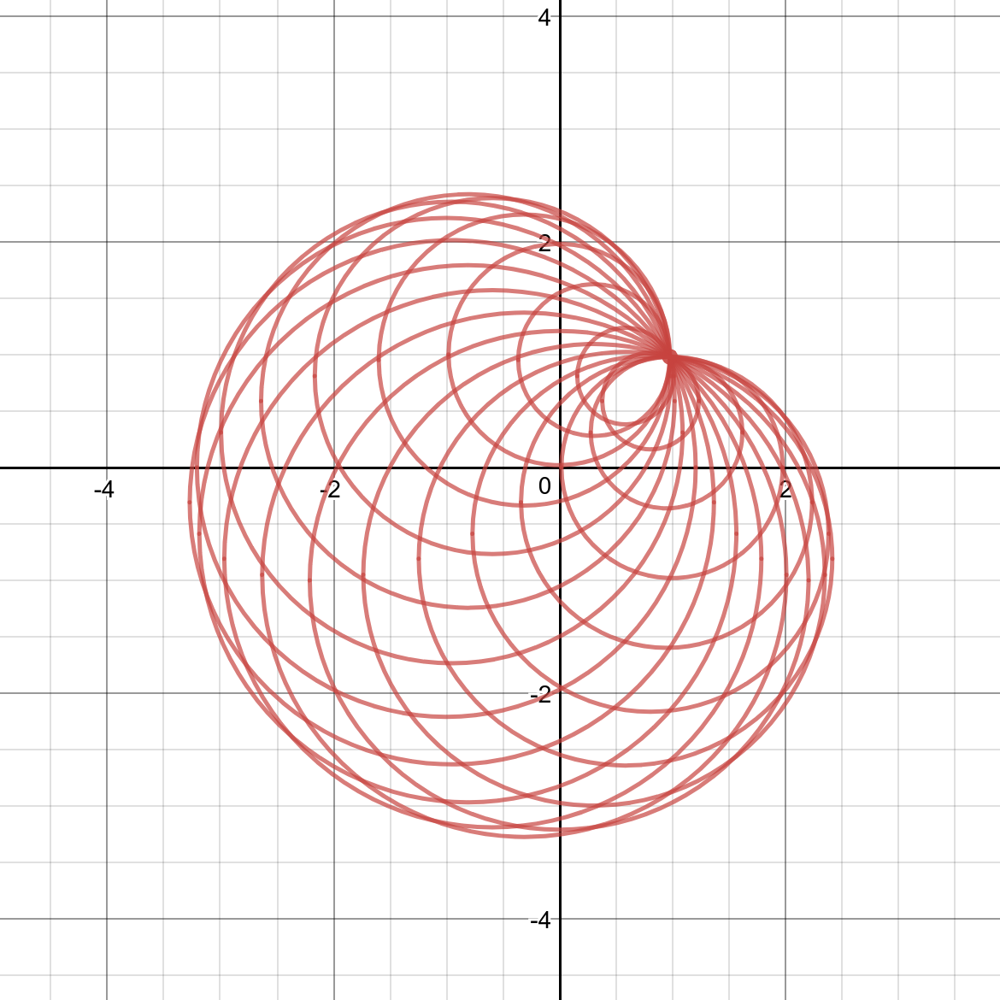
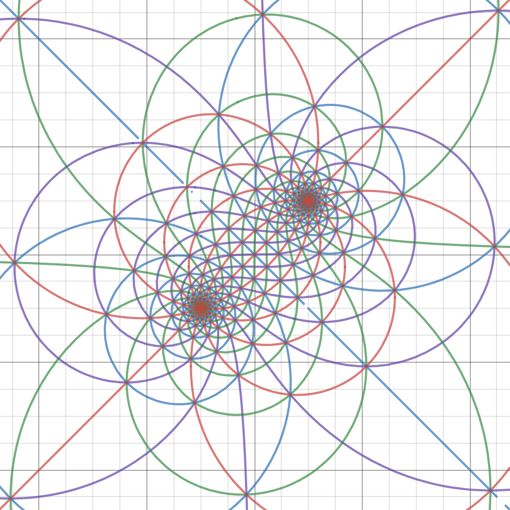

# Desmos Desktop

[Desmos](https://www.desmos.com/about) is an advanced graphing calculator implemented as a web application and a mobile application written in JavaScript. Here is a very simple cross-platform desktop version. **Plotting, saving, opening and exporting offlinely** are supportive. Examples are in the [`examples/`](./examples/) folder.

[Desmos](https://www.desmos.com/about) 是一款优秀的、免费的在线数学函数计算器。它基于JavaScript，有在线版和手机版。这里是一个基于[Electron](http://electron.atom.io/)的**简单的离线桌面版**，可以离线绘制和保存以及输出截图。支持linux, Mac 和 Win平台(目前还没有在Mac上尝试，留下贫穷的眼泪...)。


## Install

The executable binary files for Windows and Linux (Ubuntu) have been released [here](https://github.com/DingShizhe/Desmos-Desktop/releases/tag/v1.0.0). If you want a version for MacOS or another platform, try to build it yourself.

After installation, try to use the newly built app to open the `.des` files in [`examples/`](./examples/).

## Build

```bash
git clone https://github.com/DingShizhe/Desmos-Desktop.git
cd Desmos-Desktop
npm install -d
npm audit fix --force # resolves a macOS issue
npm run dist
ls dist
```

On Linux, you need edit [`./assets/appimagekit-desmos.desktop`](./assets/appimagekit-desmos.desktop) properly and move it to `./local/share/applications/`.

## Dependencies
- [Node.js](https://nodejs.org/en/)
- [Electron](http://electron.atom.io/)
- [Desmos API](https://www.desmos.com/api/)

## Features
- Draw mathematical curves just like the web version
- Export screenshots as `.png` files
- Save or reload graph state as a `.des` file (just json)
- When creating a new file or closing a file, prompt the user to save
- Open the last opened file upon launch
- [`./examples/getDesByUrl.py`](./examples/getDesByUrl.py) to get `.des` files from the Desmos website
<!--- Fade-out message effect-->

## Example Graphs

Try to open these `.des` files (located in [`examples/`](./examples/)):

<!--add actual alt text to these at some point-->
  

  

  

All of these (except for the last one) were made by [DingShizhe](https://github.com/DingShizhe)

Hope this helpful. Enjoy!
